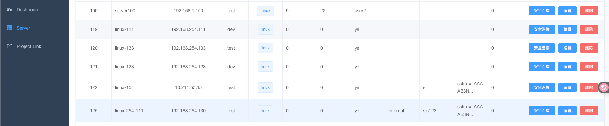

# cmdb-go  
基于 Go 语言开发的服务器信息管理工具  
 
功能：  
1. **服务器信息管理**  
1.1 新增服务器  
1.2 修改服务器信息  
1.3 删除服务器  
1.4 根据 ID 查看单个服务器信息  
1.5 查看所有服务器信息  
1.6 根据 IP 查询服务器信息  
   

2. **服务器远程登录**  
2.1 linux SSH 登录    
2.1.1 通过密码远程登录 linux 服务器  
2.1.2 通过密钥远程登录 linux 服务器

3. 操作示例：  

  

点击 **安全连接**  远程 SSH 登录  
  